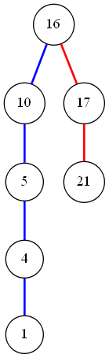

## 12.1-1

> 
> 
> 
> 
> 

## 12.1-2

> （1） 区别：二叉搜索树要求每个节点的右子树全部大于等于它，左子树全部小于等于它，而最小堆要求左右子树全部大于它。\
\
（2） 使用min-heap的性质不可能在$O(n)$的时间内顺序输出全部的key，因为排序的下届是$\theta (lgn)$建立堆只需要$O(n)$，所以全部输出一定大于等于$\theta (nlgn)$。

## 12.1-3

> （1）首先给一个使用栈的迭代版本：
<p>&emsp 遍历保存左节点，如果没有左节点了，输出这时的值，走到右节点继续执行中序遍历，按这样的思想可以写出只递归一次的中序遍历。</p>
<p>&emsp 然后再稍做思考，在新的右节点上做中序遍历再插入也不改变当前函数的栈结构，实际上相当于在新节点从插左节点开始执行而已。写出完全不需要用递归的版本。</p>

```cpp
    Half-stack-Inorder-Walk(x)
        stack S;
        while(x){
            S.push(x);
            x = x.left;
        }
        while(!s.empty()){
            x = s.pop();
            print x.key;
            if(x.right)
                Half-stack-Inorder-Walk(x.right);
        }
```
```cpp
    Stack-inorder-Walk(root)
        stack S;
        p = root;
        while(p != NIL || !S.empty()){
            while(p != NIL){
                S.push(p);
                p = p.left;
            }
            p = S.pop();
            print p.key;
            p = p.right;
        }
```

> （2）不使用栈，不使用递归的中序遍历:
<p>这个问题其实是Knuth在1968年提出的，由Morris(KMP算法中的M)在1979年解决，提出了$Morris\ Traversal$的树遍历方法，学习一下：</p>

<p> 首先，不使用栈的中序遍历最大的困难是我们没有保存路径信息，回不到过去的节点，那么我们保证达到一次遍历的尾部的时候可以回到过去节点就好了</p>
有一个叫做线索树的数据结构$(Threaded Tree)$，他是由它利用了一棵二叉查找树中的$NIL$节点（这部分指针的空间被我们无所谓得浪费掉了，单纯得指向了一个标志位），我们可以利用他们做一些事情。
<p>在中序遍历这个例子中，我们遍历是严格有序的，从小到大，也就是说，每一个后输出的值，一定是这个节点的后继。一个点有左儿子，肯定先往左儿子处走，否则如果这个点没有左儿子，就输出这个值，然后，走到它的后继，除了叶子节点以外，每个节点的后继都是它的右节点。而到达叶子节点之后怎么办？我们如果也记录了它的后继就好了，所以只需要我们遍历到一个点的时候，都求一下它的前继是谁，然后将前继的右节点指向它，这样遍历到它的前继的时候，我们可以很快到达它的后继。这样就完成了不需要栈的遍历，当然，这破坏了树的结构，所以我们需要将新加的指针删去，这样就构成了这个算法</p>

```cpp
    inorderTraversal(root) {
        p = root;
        decesser = NIL;
        while(p){
            if(p.left){
                decesser = p.left;
                while(decesser.right && decesser.right != p){
                    decesser = decesser.right;
                }
                if(decesser.right == NULL){
                    decesser.right = p;
                    p = p.left;
                }else{
                    decesser.right = NULL;
                    print p.val
                    p = p.right;
                }
            }else{
                print p.val
                p = p.right;
            }
        }
    }
```

复杂度还是O(n)，因为我们每条边最多走了两次。（找到后继的过程走的是以p为根节点的左子树的右脊，对于每个节点，他的左子树都是唯一的，不会包括相同的脊。）
## 12.1-4

```cpp
    posterorder-walk(root)
        if(root)
            poster-walk(root.left);
            poster-walk(root.right);
            print root.val;
```

```cpp
    preorder-walk(root)
        if(root)
            print root.val;
            preorder-walk(root.left);
            preorder-walk(root.right);    
```

## 12.1-5

如果我们可以用少于 $\Omega (nlgn)$的时间构造一棵二叉查找树，就可以在$O(n)$时间内输出，得到排序结果，与所有基于比较的排序算法时间复杂度下限相矛盾，所以不存在。