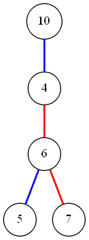

## 12.2-1
<p> c 是错的， e是错的

## 12.2-2
```cpp
    Tree-MiniMum(p)
        if(p.left)
            return Tree-MiniMum(p.left)
        else
            return p.val
```
```cpp
    Tree-MaxiMum(p)
        if(p.right)
            return Tree-MaxiMum(p.right)
        else
            return p.val
```

## 12.2-3
<p>两个情况，第一种易于理解，第二种情况，所有的左父亲都比他大，找小于它的就是找第一个右父亲。</p>

```cppW
    Tree-Predecessor(x)
        if(x.left)
            return Tree-MaxiMum(x.left)
        y = x.p;
        while(y && x = y.left)
            x = y
            y = y.p
        return y;
```

## 12.2-4

> 蓝色代表左边，红色代表右边，查找7，5属于A，4属于B，但是5>4



## 12.2-5
<p>如果后继还有左儿子，那么这个左儿子将是后继，前继同理</p>

## 12.2-6


<p>在二叉查找树中x的前继是y则y的后继就是x，因为x是y的前继，所以y就是x的后继，而且拥有左子树，根据步骤易得正确性</p>

## 12.2-7
每条边至多被遍历两次

## 12.2-8
看不懂要求我干什么，，，

## 12.2-9
y要么是x的前继，要么是后继