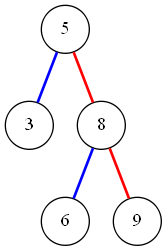

## 12.3-1

```cpp
    Tree-Insert(T,x)
        if(T==NULL)
            T.key = x
            T.left = NULL
            T.right = NULL
        else
            if(x > T.key)
                Tree-Insert(T.right, x)
            else
                Tree-Insert(T.left, x)
```

## 12.3-2

因为二叉搜索树每一个节点的位置在插入之后都不会改变，所以插入与查询走的是同一条路径，只是多了此节点而已。

## 12.3-3

因为中序遍历的时间复杂度总是$O(n)$的，而插入操作的复杂度是$O(h)$的，插入n个点的操作，显然高度一直为lgn为最佳情况，$O(nlgn)$，退化成链表情况最差，$O(n^2)$

## 12.3-4


不是。先删去3再删去5和先删去5再删去3结果不通过

## 12.3-5

succ将指向，要么是他的右子树的最小值，要么是它的第一个左祖先。实际上这样做将这棵树按顺序排列好了。按照这一点我们来写。Search本来就不需要用到p指针信息,Insert在书中的描述使用了p指针信息，但是我们可以合理得避过它，关键在于维护succ属性。\
因为新插入的节点一定没有左右子树，后继节点一定就是第一个左祖先。如果是从左边插入的，新插入节点的后继节点就是当前节点，而之前节点中后继节点是当前结点的将变为新插入节点（前后继唯一性，这样的点只有一个），也就是当前节点的第一个左祖先，因为在search到这个节点的时候这个点肯定被遍历到，所以不需要额外的复杂度。
```cpp
    Tree-Insert(T, x)
        p = T
        while(p != NIL)
            if(x < p.key)
                if(p.left)
                    p = p.left
                else
                    p.left = x
                    x.succ = p
            else
                if(!p.right)
                    p.right = x
                    x.succ = p.succ
                    p.succ = x
                else if(x < p.succ)
                    p.succ.left = x
                    x.succ = p.succ
                    p.succ = x
                else
                    if(p.succ.right == NIL && p.right > x)
                        p.succ.right = x
                        x.succ = p.succ.succ
                        p.succ.succ = x
                    else
                        p = p.right
```
解决了如何插入，接下来解决如何删除，采用拷贝删除的策略可以使问题简化，就是我们每次先不改变树的结构，把要删除的点移动到叶子，该叶子的元素移动到要删除的点，然后删除叶子就好。前继是叶子的点将前继改为叶子的前继，这样来维护信息。

## 12.3-6

随机选取策略； 删去较高一方